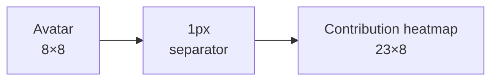
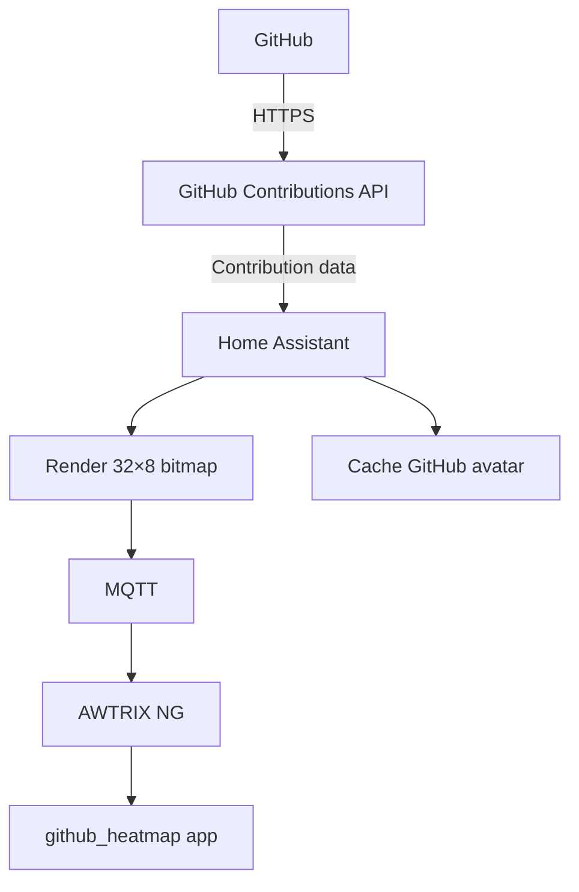
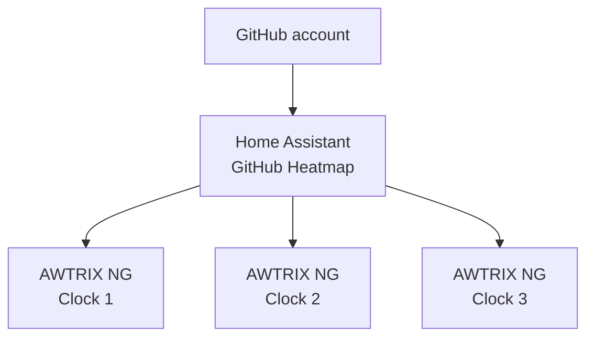
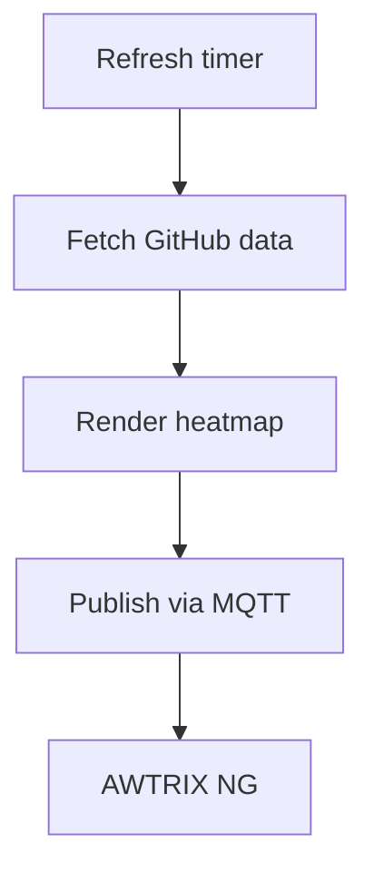
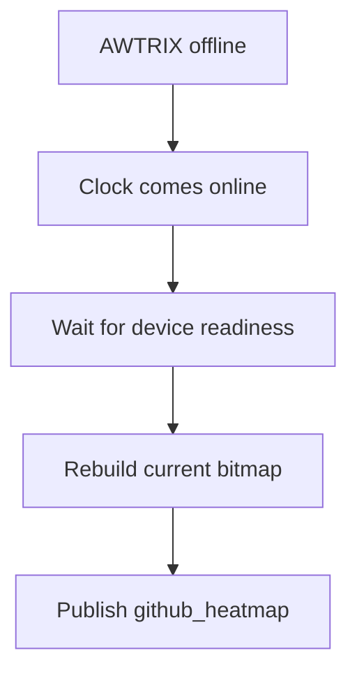

# AWTRIX NG GitHub Heatmap

Display your **GitHub contribution activity directly on an AWTRIX NG clock through Home Assistant**.

A native Home Assistant custom integration that fetches the last 365 days of GitHub contribution data, renders it into the AWTRIX NG **32×8 pixel matrix**, and publishes it as an AWTRIX pushed app.

> **Home Assistant · AWTRIX NG · GitHub · MQTT · HACS**

---

## ✨ Features

- 📊 **365-day GitHub contribution heatmap**
- 🖥️ **AWTRIX NG 32×8 matrix rendering**
- 👤 **GitHub avatar rendered as an 8×8 image**
- 🔄 Configurable automatic refresh interval
- 💾 Avatar caching to avoid unnecessary downloads
- 🖥️ **Multiple AWTRIX NG clocks**
- 👤 One GitHub account per integration entry
- 🔀 Multiple integration entries for different GitHub accounts
- ⚡ Automatically republishes when an AWTRIX clock comes back online
- 🚫 Disabling the integration removes `github_heatmap` from selected clocks
- ➕ Adding a clock immediately publishes the app
- ➖ Removing a clock removes the app from that clock
- 🔁 GitHub API failures are retried
- 📡 MQTT failures are retried independently per clock
- 🛡️ Temporary failures do not intentionally clear the last valid display
- 🔄 Manual refresh through `github_heatmap.refresh`
- 📈 Home Assistant status sensors
- 🎨 GitHub-style contribution levels
- 🌈 Rainbow months: **OFF**
- 📅 Month splitting: **OFF**
- 👤 Avatar: **ON**

---

## 🖼️ Display layout

The AWTRIX NG matrix is divided into an 8×8 avatar area, a one-pixel separator, and the contribution heatmap.



The complete AWTRIX matrix remains **32×8 pixels**.

The renderer internally uses column-major pixel data and converts the final bitmap to the row-major representation expected by AWTRIX.

---

## 🔌 How it works

Everything runs directly inside Home Assistant. No Cloudflare Worker or separate application is required.



The integration dynamically discovers the MQTT prefix associated with each selected AWTRIX NG device through Home Assistant's MQTT entities.

MQTT prefixes and clock names are therefore **not hardcoded**.

---

## 🖥️ Multiple AWTRIX clocks

Multiple AWTRIX NG clocks can be selected in a single integration entry.



Each clock is handled independently.

A failure or offline state on one clock does not prevent the integration from attempting to update the others.

### Multiple GitHub accounts

Each integration entry represents **one GitHub account**.

For example:

```text
GitHub Heatmap #1
├── GitHub: user_a
├── Clock 1
└── Clock 2

GitHub Heatmap #2
├── GitHub: user_b
└── Clock 3
```

This allows multiple accounts without complicating the configuration of an individual integration entry.

---

## 📡 GitHub data source

This project was inspired by and uses the API provided by:

**[grubersjoe/github-contributions-api](https://github.com/grubersjoe/github-contributions-api)**

Many thanks to **grubersjoe** for creating and maintaining the upstream project.

The API exposes GitHub contribution history as structured JSON, including contribution totals, dates, counts, and contribution levels.

For the last 365 days, this project uses:

```text
https://github-contributions-api.jogruber.de/v4/<USERNAME>?y=last
```

For example:

```text
https://github-contributions-api.jogruber.de/v4/osamashabrez?y=last
```

The `?y=last` parameter requests the contribution data corresponding to GitHub's last-year contribution view.

See the upstream project for API implementation details, caching behavior, limitations, and licensing:

https://github.com/grubersjoe/github-contributions-api

---

## 🏠 Home Assistant

The project is implemented as a native Home Assistant custom integration.

Integration domain:

```text
github_heatmap
```

Installation location:

```text
/config/custom_components/github_heatmap/
```

The integration provides:

- Config flow
- Options flow
- Multiple AWTRIX device selection
- Automatic refresh
- MQTT publishing
- AWTRIX availability handling
- Avatar caching
- Status sensors
- Manual refresh service

---

## ⚙️ Configuration

After installation:

**Settings → Devices & services → Add integration → GitHub Heatmap**

Configure:

| Setting | Description |
|---|---|
| **GitHub username** | GitHub account whose contribution graph is displayed |
| **AWTRIX clocks** | One or more AWTRIX NG clocks |
| **Refresh interval** | How often contribution data is fetched |
| **Enabled** | Enable or disable the heatmap |

### Current defaults

```text
Avatar:          ON
Rainbow months:  OFF
Month split:     OFF
Refresh:         60 minutes
```

---

## 🔄 Configuration behavior

Configuration changes are applied through Home Assistant's integration reload mechanism.

### Enabled → OFF

The integration removes:

```text
github_heatmap
```

from all selected clocks.

No separate removal automation is required.

### Enabled → ON

The integration fetches the latest contribution data and publishes the app.

### Add a clock

The newly selected clock receives the current heatmap.

### Remove a clock

The integration removes the `github_heatmap` app from the removed clock.

### Change username

The integration reloads using the new GitHub account.

### Change refresh interval

The coordinator is recreated with the new interval.

---

## 🔄 Automatic refresh

The integration uses Home Assistant's `DataUpdateCoordinator`.



A normal refresh does **not** unnecessarily download the avatar again.

The contribution data and avatar are handled independently.

---

## 👤 Avatar caching

The GitHub avatar is permanently enabled.

The avatar is:

1. Retrieved from GitHub.
2. Resized to **8×8 pixels**.
3. Converted into the AWTRIX bitmap representation.
4. Cached in memory.

The current avatar cache period is:

```text
24 hours
```

Therefore a contribution refresh does not cause an avatar download every time.

If an avatar refresh fails, the previously cached avatar is retained when available.

---

## 📡 AWTRIX availability

Each selected clock has its own availability subscription.



When an AWTRIX clock comes back online, the integration republishes the current heatmap automatically.

Other clocks continue operating independently.

---

## 🎨 Rendering

The integration renders:

```text
32 × 8 = 256 pixels
```

The first 8 columns are reserved for the avatar.

A one-pixel separator follows the avatar.

The remaining columns contain the contribution heatmap.

Contribution levels use:

| Level | Color |
|---:|---|
| 0 | `0x161B22` |
| 1 | `0x0E4429` |
| 2 | `0x006D32` |
| 3 | `0x26A641` |
| 4 | `0x39D353` |

Current rendering configuration:

```text
Rainbow months: OFF
Month split:    OFF
Avatar:         ON
```

---

## 🧯 Error handling

The integration is designed to tolerate temporary failures.

### GitHub API

Requests are retried when they fail.

If the refresh ultimately fails, the existing successful coordinator data is retained rather than intentionally replacing the display with an empty heatmap.

### MQTT

MQTT publication is retried.

Each selected clock is handled independently.

A failed clock does not prevent publishing to another clock.

### AWTRIX offline

The application is not deliberately removed simply because a clock is temporarily unavailable.

When the clock reports that it is online again, the current heatmap is republished.

---

## 🔄 Manual refresh

The integration provides:

```yaml
action: github_heatmap.refresh
```

This forces an immediate refresh.

It:

1. Fetches the latest GitHub contribution data.
2. Re-renders the heatmap.
3. Publishes it to all selected AWTRIX clocks.

This is useful when testing changes without waiting for the configured refresh interval.

---

## 📊 Home Assistant entities

The integration exposes status information through Home Assistant sensors.

### Contributions

The GitHub contribution total for the last-year dataset.

### Last Update

Timestamp of the last successful GitHub contribution update.

### Last Publish

Timestamp of the last successful AWTRIX MQTT publication.

These make it easier to determine whether the integration is operating normally.

---

## 📦 Installation

### HACS

Once the repository is available through the HACS default repository list:

1. Open **HACS**.
2. Search for **AWTRIX NG GitHub Heatmap**.
3. Install the integration.
4. Restart Home Assistant if requested.
5. Go to **Settings → Devices & services**.
6. Add **GitHub Heatmap**.

### HACS custom repository

During development, the repository can be added manually as a custom HACS repository:

```text
https://github.com/OsamaShabrez/ha-awtrix-github-heatmap
```

Select:

```text
Integration
```

---

## 🧑‍💻 Repository structure

```text
ha-awtrix-github-heatmap/
├── custom_components/
│   └── github_heatmap/
│       ├── __init__.py
│       ├── config_flow.py
│       ├── const.py
│       ├── coordinator.py
│       ├── manifest.json
│       ├── renderer.py
│       ├── sensor.py
│       ├── services.yaml
│       └── translations/
│           └── en.json
│
├── .github/
│   └── workflows/
│       └── hacs.yml
│
├── hacs.json
├── README.md
└── LICENSE
```

---

## 🧪 Development & validation

The repository uses GitHub Actions to validate the integration.

The intended validation pipeline includes:

- HACS validation
- Home Assistant Hassfest validation
- Integration manifest validation
- Repository structure validation

Changes should be committed and pushed through Git so that validation runs automatically.

---

## 🚧 Project status

This project is actively developed for:

- **Home Assistant**
- **AWTRIX NG**
- **MQTT**
- **GitHub**
- **HACS**

The goal is a reliable, simple, Home Assistant-native way of displaying GitHub contribution activity on AWTRIX NG clocks.

---

## 🙏 Credits

### GitHub Contributions API

Special thanks to **[grubersjoe](https://github.com/grubersjoe)** for the inspiration and the upstream GitHub Contributions API used by this project.

Upstream project:

https://github.com/grubersjoe/github-contributions-api

### Home Assistant

Built as a Home Assistant custom integration using Home Assistant's integration, config-flow, coordinator, MQTT, and entity architectures.

### HACS

Designed for distribution and updates through the **Home Assistant Community Store (HACS)**.

---

## 📄 License

See [`LICENSE`](LICENSE) for the license applicable to this project.

The upstream `github-contributions-api` project has its own license and terms. Refer to the upstream repository for those details.

---

## ⭐ Contributing

Issues, bug reports, improvements, and pull requests are welcome.

When reporting an issue, please include:

- Home Assistant version
- GitHub Heatmap version
- AWTRIX NG firmware version
- Number of configured clocks
- Relevant Home Assistant logs
- Relevant MQTT logs

**Never include GitHub tokens, MQTT credentials, passwords, or other secrets in issues or pull requests.**
