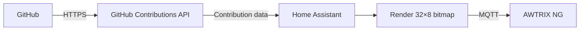

# AWTRIX NG GitHub Heatmap

Display your **GitHub contribution heatmap on AWTRIX NG clocks through Home Assistant**.

A native Home Assistant custom integration that fetches the last 365 days of GitHub contribution data, renders it for the AWTRIX NG **32×8 matrix**, and publishes it over MQTT.

## Features

- 📊 365-day GitHub contribution heatmap
- 👤 GitHub avatar rendered as an 8×8 image
- 🖥️ Multiple AWTRIX NG clocks per integration
- 👥 One GitHub account per integration entry
- 🔄 Configurable refresh interval
- 💾 Avatar caching
- 📡 Per-clock MQTT handling
- ⚡ Automatic republishing when a clock comes back online
- 🚫 Automatic app removal when disabled or a clock is removed
- 🔄 Manual refresh via `github_heatmap.refresh`
- 📈 Home Assistant status sensors
- 🌈 Rainbow months disabled
- 📅 Month splitting disabled

## How it works



The MQTT prefix is discovered dynamically from the selected AWTRIX NG device in Home Assistant. Clock names and MQTT prefixes are not hardcoded.

## Configuration

Install **GitHub Heatmap** through HACS, then go to:

**Settings → Devices & services → Add integration → GitHub Heatmap**

Configure:

| Setting | Description |
|---|---|
| **GitHub username** | Account whose contribution heatmap is displayed |
| **AWTRIX clocks** | One or more AWTRIX NG clocks |
| **Refresh interval** | How often contribution data is refreshed |
| **Enabled** | Enable or disable the display |

Multiple GitHub accounts can be configured by creating separate integration entries.

### Defaults

- Avatar: **ON**
- Rainbow months: **OFF**
- Month split: **OFF**
- Refresh: **60 minutes**
- Matrix: **32×8**

## Rendering

The display uses the AWTRIX NG **32×8** matrix. The first 8 columns contain the avatar, followed by a one-pixel separator. The remaining area displays the contribution heatmap.

Contribution levels use GitHub-style green shades.

## Reliability

Temporary GitHub or MQTT failures do not intentionally clear the last valid display.

Each selected AWTRIX clock is handled independently. If a clock goes offline and later returns, the current heatmap is automatically republished.

Configuration changes are applied through the integration:

- Disabling removes the app from selected clocks.
- Enabling republishes the app.
- Adding a clock publishes to it.
- Removing a clock removes the app from it.
- Changing the username or refresh interval applies the new configuration.

No separate removal automation is required.

## Manual refresh

The integration provides:

```yaml
action: github_heatmap.refresh
```

This immediately fetches the latest contribution data, renders the heatmap, and publishes it to the selected clocks.

## GitHub API

The integration uses:

```text
https://github-contributions-api.jogruber.de/v4/<USERNAME>?y=last
```

The `?y=last` endpoint provides the contribution data used to recreate GitHub's last-year contribution calendar.

## Installation

### HACS

Search for **AWTRIX NG GitHub Heatmap** in HACS and install it.

During development, the repository can also be added as a HACS custom repository:

```text
https://github.com/OsamaShabrez/ha-awtrix-github-heatmap
```

Select **Integration**.

Then add **GitHub Heatmap** through:

**Settings → Devices & services → Add integration**

## Development

The integration is located at:

```text
custom_components/github_heatmap/
```

GitHub Actions validate the repository with HACS and Home Assistant Hassfest.

## Credits

Inspired by and built using the **[GitHub Contributions API](https://github.com/grubersjoe/github-contributions-api)** by **[grubersjoe](https://github.com/grubersjoe)**.

Built as a native Home Assistant custom integration for AWTRIX NG and distributed through HACS.

## License

See [LICENSE](LICENSE) for the project license.

The upstream GitHub Contributions API has its own license; see the upstream project for its terms.

## Contributing

Issues, bug reports, improvements, and pull requests are welcome.

When reporting an issue, include:

- Home Assistant version
- GitHub Heatmap version
- AWTRIX NG firmware version
- Number of configured clocks
- Relevant Home Assistant/MQTT logs

**Never include GitHub tokens, MQTT credentials, passwords, or other secrets.**
